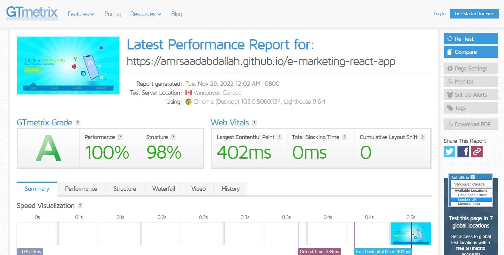

<h1 align="center" >E-Marketing &mdash; React App</h1>

### 👁️ Project Preview:

- [ Live Preview 👉 https://amrsaadabdallah.github.io/e-marketing-react-app](https://amrsaadabdallah.github.io/e-marketing-react-app)

- [ Github Repo 👉 https://github.com/amrsaadabdallah/my-e-marketing-react-app](https://github.com/amrsaadabdallah/my-e-marketing-react-app)
  - 🚩 It's a private repo <a target="_blank" href="mailto:amrsaadabdallah@gmail.com">contact me </a>to see.

---

### 📝 Project Description & features:

- It's a medium react app (E-Marketing) used to practice react features & TailwindCSS for styling.
- It consists of 4 pages (Home, About, Clients, Contact).

---

### 🛠️ Project Tools:

1. Used Google Fonts.

1. TailwindCSS for styling.

1. ReactJS Library.

1. react-router-dom pack for handling Client side routing.

1. PropTypes package for typechecking component props.

1. [LottieFiles](https://lottiefiles.com) web service for getting animations images ([explaination](./info/lottiefiles-demo.jpg)).

1. [Squoosh](https://squoosh.app/) is an online tool for image compression web app that reduces image sizes through numerous formats.

1. [GTmetrix](https://gtmetrix.com/) is an online tool for customers to easily test the performance of their webpages.

---

### :sparkles: Project Skills applied:

1. Create Multiple React Component.

1. Configuration react component by props.

1. Render List of items.

1. Apply Conditional Rendering.

1. Deal with form.

1. Use React Hook (UseState, useEffect).

1. Compression images using [Squoosh](https://squoosh.app/) tool.

1. Test the performance of the webpage after deploy by using [GTmetrix](https://gtmetrix.com/).

---

### 🧪 Project performance test:

Test the performance of the webpage after deploy by using [GTmetrix](https://gtmetrix.com/).

---

### 👋 Get In Touch:

- [🌐 Website 👉 https://amrsaadabdallah.github.io](https://amrsaadabdallah.github.io)
- [👔 LinkedIn 👉 https://www.linkedin.com/in/amrsaadabdallah](https://www.linkedin.com/in/amrsaadabdallah)
- [🌟 Github 👉 https://github.com/amrsaadabdallah](https://github.com/amrsaadabdallah)
- [📧 Gmail 👉 amrsaadabdallah@gmail.com](mailto:amrsaadabdallah@gmail.com)
- [🐤 Twitter 👉 https://twitter.com/amrsaadabdallah](https://twitter.com/amrsaadabdallah)
- [:phone: Whatsapp 👉 (+20) 109-775-6067](https://api.whatsapp.com/send/?phone=%2B2001097756067&text&type=phone_number&app_absent=0)

---

<a target="_blank" href="https://amrsaadabdallah.github.io">

 2022 &copy; Amr Saad Abdallah 

</a>

